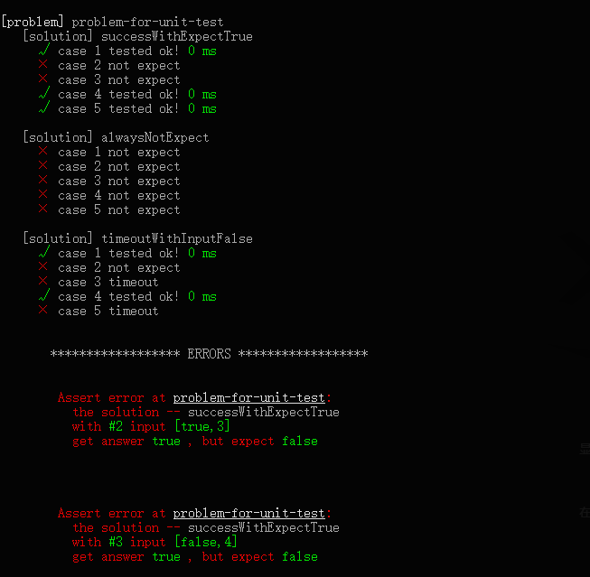

<h1 align="center"><a href="https://github.com/zthxxx/leetsolve" target="_blank">LeetSolve.js</a></h1>

[](https://travis-ci.org/zthxxx/leetsolve)
[](https://codeclimate.com/github/zthxxx/leetsolve/maintainability)
[](https://nodejs.org/)
[](https://leetcode.com/zthxxxme/)

:cake: simple & light testing frame for LeetCode solutions with JavaScript


## Feature

optimized for the algorithms question pattern, test output for input, such as LeetCode

- easy to describe a problem and testcase
- lightweight testing frame which a bit like mocha, but more features which are mocha NOT support
- using **multiprocessing**, speed up testcase
- canable to stop timeout testing with **infinite loop**
- direct to run a single problem solution for test
- also support hooks like `beforEach` `before` `after` `afterEach`


## Style preview

output reporters style adjust to like mocha spec, preview some example:




## Unit test

chone it, then run the unit test

```bash
git clone git@github.com:zthxxx/leetsolve.git
cd leetsolve
npm i
npm run unit
```

you will get the result as shown above, those examples problem in [`test/examples`](./test/examples/)


## Usage

replace your problems and solutions in [`problems/`](./problems/)

to define a problem, as the same structure of unit test examples,

a problem is a folder which named its description, with two files in it, `index.js` as solution, `testcase.js` as test case.

```
problems/
│
└─ problem1-description/  # define problem 1
   │
   ├─ index.js            # solution file
   └─ testcase.js         # problem testcase file
```

in **`index.js`**, you may want export one or more solutions, for example:

```js
function solution1 () {}
function solution2 () {}
/**
 * @type {(function | function[])} - exports
 */
// export one solution
module.exports = solution1
// or export some more solutions
module.exports = [solution1, solution2]
```

it's means test the specified solution or test all.

solutions will gain input arguments with testcase `input` field, and compare its output to testcase `expect` field.

so, in `testcase.js`, should export list of input and expect:

```js
/**
 * @type {{input: any[], expect: any}[]} - exports
 */
module.exports = [
  {
    input: ['a', 'b'],
    expect: 1
  }
]
```

see the [example code](./test/examples/problem-for-unit-test) that you will understand immediately, I promise.

### hooks

**lifecycle hooks**

support to use `beforeEach` `afterEach` hooks on exports, if the exports is array,

and use `before` `after` hooks on each solutions.

hook of before deal with input arguments and output processed 'input args' for next hook,

oppositely, hook of after deal with output result, origin in, processed out.

the full resolution flow:

```
beforeEachs -> befores -> solution -> afters -> afterEachs
```

```js
// register beforeEach or afterEachs hook
module.exports = [solution1, solution2]
/**
 * @type {(function | function[])} - beforeEach | afterEachs
 */
module.exports.beforeEach = input => input
// or
module.exports.beforeEach = [() => {}, () => {}]
```

```js
// register before or after hook
module.exports = [solution1, solution2]
/**
 * @type {(function | function[])} - before | after
 */
solution1.before = () => {}
// or
solution2.after = [() => {}, () => {}]
```

**timeout setting hook**

support to set different timelimit to specific problem or solution. By ues `timeout` property as lifecycle hooks.

**direct running hook**

you may want to direct run a solution file for test as `node ./problem-1/index.js` or `node ./problem-1`

all right, only ensure `index.js`  **require** this hook module **`libs/runDirect.js`**

```js
// problems/problem-for-unit-test/index.js
require('../../libs/runDirect')
```

### configure

you can also adjust problems path at `problemBase` and testcase file name at `casefile` in `config.js`

more options description see [config.js](./config.js)


ok, come on, try out!


## Author

**LeetSolve** © [zthxxx](https://github.com/zthxxx), Released under the **[MIT](./LICENSE)** License.<br>

> Blog [@zthxxx](https://blog.zthxxx.com) · GitHub [@zthxxx](https://github.com/zthxxx)
